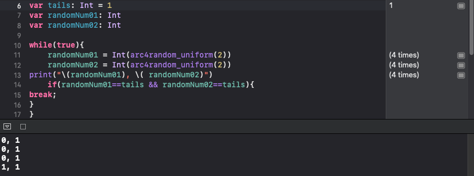
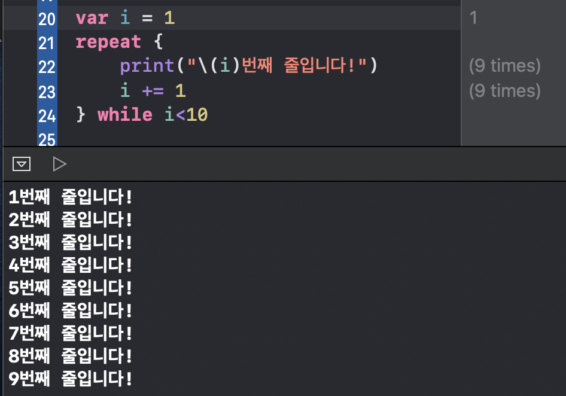

---
layout: default
title: conditionals 
parent: iOS
grand_parent: 코딩공부
nav_order: 3

---  

## swift 이틀차!  
오늘은 소맥을 마시고.. 강의 정리를 해본다..  
취중 코오딩!!  
swift야.. 사랑했뜨ㅏㅏㅏㅏㅏㅏㅏㅏ~~!!~!~!~!~!~!~  


## 예제를 통한 swift 에서의 if문  
`guestList`에 있다면, 환영인사를 보내고!  
그렇지 않다면 초대를 거절하는 if 문 예시를 작성해보자!  

```swift
if onGuestList {
    print("\(name), welcome!")
}

if !onGuestList {
    print("\(name), sorry but you are not on my guestlist!")
}
```
  
조건이 두개 이상 일 때에는 어떻게 할까?  
guestList 에 없거나, 21살 보다 어릴 때에는 거절하는 메세지를 띄우도록 해보자!  

```swift 
if (isGuestList && age>=21) {
print("\(name), welcome! you are adequate for this party!!")
}
if(!isGuestList || age<21){
print(\(name), sorry, but you are not over 21, or you are not on my guest list. ")
}
```
  
## swift 에서의 multiple conditions  
swift 에서 조건문을 여러개 만들기 위해서는 어떻게 할까!!  
java 와 아주 똑같다! 아닌가... 아니다! 조금 다르다 ㅎㅎ swift 에서는 괄호를 안써도 된다!  

```swift 
if isFirstCondition {
   print("이것은 첫번째 조건문이 만족되면 출력됩니다.")
 } else if isSecondCondition {
   print("이것은 두번째 조건문이 만족되면 출력됩니다.")
 } else if isThirdCondition {
   print("이것은 세번째 조건문이 만족되면 출력됩니다.")
 } else {
   print("이것은 모든 조건문이 만족 안된다면 출력됩니다.")
}
```
  
## swift 에서의 switch  
java 와 정말 똑같다!!  

```switch month {
case 1: print("1월")
case 2: print("2월")
case 3: print("3월")
}

## swift 에서의 range(범위)  
>> 이것은! swift 에서만의 특징이다.  
>> 눈여겨 보시길....  

예를 들어, `1,2,3,4,5`를 출력하려고 할 때에, 다음과 같이 표현할 수 있다. 
```swift
//첫번째 경우 
1...5 

//두번째 경우
1..<6
```
  
위의 두가지 경우 모두 1,2,3,4,5를 의미하게 한다.  
  
    
    
## swift 문에서 i를 이용한 for문  
    java 에서는 for 문을 보통 int i 를 이용하여 많이 사용한다!  
    이러한 i 를 iterator(반복자) 라고 부르고, swift 에서는 iterator 를 사용할 수도, 사용하지 않을 수도 있다!  

### 1. `iterator` 를 사용하는 경우  

```swift
for i in 1...15 {
  print(i)
}
```
출력: `123456789101112131415`  
  
### 2. `iterator` 를 사용하지 **않는** 경우  

```swift
for _ in 1..3 {
  print("안녕")
}
``` 

출력: `안녕  
안녕  
안녕`  
  
### 3. 그 외의 경우  
String 의 각각의 character 개수만큼 각각의 character 를 출력하도록 할 수 있다!  
array (배열) 의 개념을 사용하는 것이다.  

```swift
let word = "github" //총 6개의 character 를 가진 문자열 word 를 선언한다!  
for char in word {
    print(char)
}
```

출력:  
`g`  
`i`  
`t`  
`h`  
`u`  
`b`  
  
## (번외) swift 에서의 랜덤함수  
swift 에서의 랜던함수가 for 문을 공부하는데 계속해서 나와서 공유한다...  
왜 자꾸 안배운 것을 알려주는걸까.. 이런 코오딩 공부란.. 끝이 없는 것..  
   
### 1. **arc4random()**  
  - 리턴 타입이 UInt32이다. 즉, 0부터 2^32-1 범위를 가진다.  
  - 즉, 0과 2^32-1 사이의 난수를 반환한다.  
  
### 2. **arc4random_uniform(UInt32)**  
  - 파라미터로 UInt32를 받는다! --> 0부터 파라미터로 넣은 UInt32-1 사이의 난수를 리턴한다.  
  - `var randomNumber = arc4random_uniform(400)`은, 0과 399 사이의 난수를 리턴하게 된다.  
    
  #### 예시  
  <div class="code-example" markdown="1">  
  0과 1 중에서 랜덤으로 변수에 값을 저장하고 싶으면, 
  ```swift
  var randomNumber = arc4random_uniform(2)
  ```
  이렇게 지정해주면 된다.  
  </div>

### 3. **drand48()**  
  - 0부터 1.0 사이의 난수를 리턴한다.  

  
## while loop 예시  

<div class="code-example" markdown="1">  

### 첫번째 문제  
### 0...1000까지의 범위에서 짝수만을 출력하는 swift 문을 작성하라!  

```swift 
var div: Int = 1 //integer type 의 div 를 1로 초기화 한다.  
while(!(div*2==1002)){ //1002가 되기 전까지 while 문을 돌린다.  
    print(div*2) //div에 2를 곱하여 프린트 한다. 
    div += 1     //곱한 이후에는 div 를 1 씩 증가시킨다.  
}
```

</div>
  
<div class="code-example" markdown="1">  

### 두번째 문제  
### 0...500까지의 범위(inclusive, 즉 500을 포함하는 범위)에서 짝수만을 출력하는 swift 문을 작성하라!  

```swift 
var number = 0

while true {
    number += 2
    print(number)
    if(number == 500){
        break
    }
    
}

```

</div>
  
<div class="code-example" markdown="1">  
  
### 세번째 문제
### 두 코인 모두 뒷면이 나올 때까지 두 코인이 뒷면, 혹은 앞면이 나오는지를 프린트 해라.  

```swift 
var tails: Int = 1
var randomNum01: Int
var randomNum02: Int

while(true){
    randomNum01 = Int(arc4random_uniform(2))
    randomNum02 = Int(arc4random_uniform(2))
print("\(randomNum01), \( randomNum02)")
    if(randomNum01==tails && randomNum02==tails){
break;
}
}
```

출력:


</div>
  
  
## reapeat-while 문  
java, c언어에서의 `do-while`문 과 같다!  
  
<div class="code-example" markdown="1">  
  
예시:
<div class="code-example" markdown="1">  

```swift 
var i = 1
repeat {
    print("\(i)번째 줄입니다!")
    i += 1
} while i<10
```

출력:  


</div>


