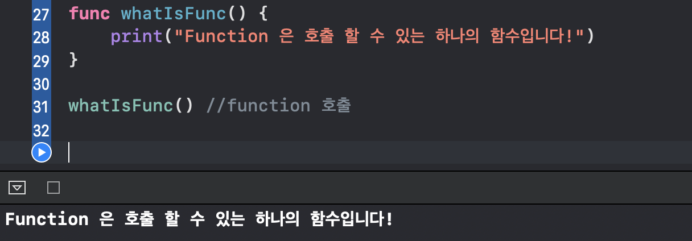
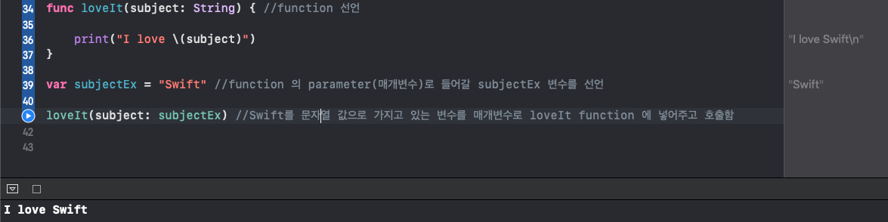

## iOS 세번째 날!  
캡스톤 공모전도 준비를 해야해서 정신이 없다 ㅠㅠ  
부모님도 오늘 오랜만에 올라오시공,,, 아이공,,, 공,,, zero,,,  
아무래도 오늘은 조금밖에 못할 것 같은 느낌!!   

## list of lessons for today  

| **index** | **topic** |  
| :----------: | :-----------------------: |
| 1 | [](#) |
| 2 | [](#) |
| 3 | [](#)|
| 4 | [](#)|
| 5 | [](#) |  
| 6 | [](#) |
| 7 | [](#)|
| 8 | [](#)|
| 9 | [](#) |  
| 10 | [](#)|

## function 이해하기  
예시를 통해 쉽게 이해할 수 있다!  

```swift
func whatIsFunc() {
    print("Function 은 호출 할 수 있는 하나의 함수입니다!")
}

whatIsFunc() //호출 

```

출력:  

  
## function signature 란    
function 을 선언할 때, `addValues(value1: Int, value2: Int)` 이 부분을 **function signatue** 라고 부른다.  
  
    
## parameter(매개변수)를 포함한 funcion 사용  

### 단일 매개변수인 경우  

```swift 
func loveIt(subject: String) { //function 선언
    
    print("I love \(subject)")
}

var subjectEx = "Swift" //function 의 parameter(매개변수)로 들어갈 subjectEx 변수를 선언

loveIt(subject: subjectEx) //Swift를 문자열 값으로 가지고 있는 변수를 매개변수로 loveIt function 에 넣어주고 호출함 
```

출력:  

  


### 매개변수가 여러 개인 경우  

```swift
func areaOfRectangle(length: Int, width: Int){ //가로와 세로를 int 값으로 가져올 매개변수를 넣어준다.
  print("이 사각형의 넓이는: " + String(length*width) + "이다.") //print를 할 때에는 int 값을 print 가능한 문자열로 바꾸어준다.
}

areaOfRectangle(length: 20,width: 10)

```

출력: `이 사각형의 넓이는: 200이다.`  
  
## return 값 지정하기  
function 의 특징은 바로 **return**값이 있다는 것이다!  
return 값을 function 에서 지정해줄 수 있는데, 그 data type 에 대해서 function 을 처음에 선언할 때 언급해야한다.

예를 들어 areaOfTriangle 이라는 func 에서 리턴값을 Double 로 지정하고 싶다면, 아래와 같이 `-> Double` 을 추가한다.  

```swift  
func areaOfTriangle(base: Double, height: Double) -> Double{
    return 0.5*base*height
}
let area: Double

area = areaOfTriangle(base: 4, height: 10)

print(area)

```

출력: `20`    

## parameter의 default값 지정하기  
function에 들어가는 매개변수들이 매번 들어오는 값에 따라 달라지는 것이 아니라, 몇 개의 매개변수중 특정 변수는 **기본 값**으로 항상 같은 값을 가지도록 하는 것이 필요할 수 있다.  
이렇게 하기 위해서는 **처음에 매개변수를 선언 할 때에 값을 지정해주면 된다.**

```swift

func endOfYearBonus(basePay: Double, bonus: Double, percentBonus: Double = 0.10 ) -> Double {
    return basePay+bonus+(basePay * percentBonus)
}

print(endOfYearBonus(basePay: 10.0, bonus: 10.0)) //percentBonus 지정 하지 않음, 위의 default 값 이용 
print(endOfYearBonus(basePay: 10.0, bonus: 10.0, percentBonus: 0)) //위의 deafult 값 override 
```
출력: `21.0  20.0`
  
  
## 전역 매개변수, 지역 매개변수 (Internal and External Parameter Names)  
### 01 internal parameter name  

```swift
func addVaolues(value1 x: Int, value2 y: Int) { //이렇게 작성하면 이 function 내에서 x 와 y를 지역변수로 사용하게된다.
    return x+y 
}
```
  
### 02 external parameter name  
전역 매개변수는 기존에 사용하던 대로 하는 방식을 의미하는데,  
사실 매번 전역 매개변수를 full name 으로 호출하여 parameter 이름을 넣어주기가 귀찮다.  
무슨 말이냐면...  

```swift 
func loveIt(subject: String) { 
    
    print("I love \(subject)")
}
loveIt(subject: "앞에 매개변수이름인 subject를 매번 써주는 것이 귀찮다는 것이다..!")
```
위 코드에서 언급했듯이, function을 호출하면서 전역 매개변수를 매번 써주고 그 뒤에 입력할 데이터를 넣는 것이란 굉장히 귀찮은 일이다...  
그래서 아래와 같이 매개변수를 넣어주면 호출할 때에 매개변수 이름을 넣어줄 필요가 없게된다!  


```swift
func loveIt(_ subject: String) { 
    print("I love \(subject)")
}
loveIt("앞에 매개변수이름인 subject를 안써줘도 된당") //매개변수 이름을 안써줘도 된다!
```  

