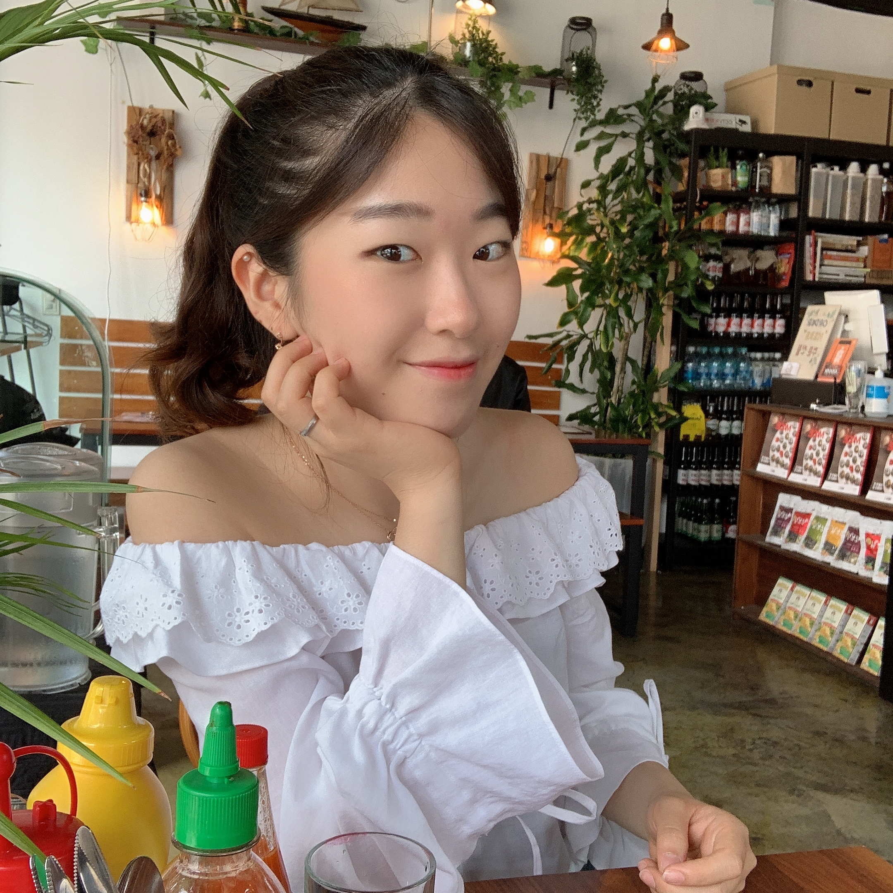

 <h2 align="center"> :raised_hands: Hi, it's a nice day to dig in more codes! :raised_hands: </h2> 
      
____________

## :seedling: iOS developer  
글로벌 iOS 개발자를 꿈꾸고 있는 선민승입니다 :D  
  
- Github: https://github.com/minseungseon/  
- Instagram: @for_xuexi  
- Email: seonminseung@naver.com   

## :pushpin: 함께 일하기 좋은 iOS 개발자가 되기 위해 노력합니다.  
- **storyboard**를 활용하여 iOS 프로젝트를 진행한 경험과 오직 **programmatically** iOS 개발을 진행한 경험 모두 있습니다.  
- github을 통해 iOS 프로젝트를 서버담당자와, 웹담당자와 함께 협업한 경험이 있습니다.  
- 더 나은 아키텍쳐를 가진 앱을 만들기 위해 고민해보았습니다.  

## :sparkles: 다양한 분야에서의 경험을 갖춘 개발자입니다.  
- **명덕외국어고등학교 중국어과**를 졸업하여 **중앙대학교 영어교육학과 18학번**으로 입학해, 2년간의 영어교육학 공부를 했습니다.  
-  높은 수준의 **영어 회화,작문,독해 능력**을 갖추고 있으며 간단한 중국어 회화 및 독해를 할 수 있습니다.  
- 2020년에 중앙대학교 **소프트웨어학과**로 3학년 전과를 하여 깊은 CS 지식을 쌓아나가고 있습니다.  
- 다양한 도전과 활동을 통해 웹 프런트,벡엔드의 경험이 있으며 2020년 부터 iOS 개발자의 진로를 정하여 꾸준히 노력하고 있습니다.  
- AI/딥러닝 관련 교육을 수료한 경험이 있습니다. (한국인공지능아카데미 딥러닝 음성챗봇 교육, 한국인공지능아카데미 파이썬으로 챗봇 만들기 교육, 2019 양재혁신허브 AI SCHOOL 비전공자를 위한 인공지능 입문과정(케라스 코리아))  

## :herb: 소통의 경험이 있는 개발자입니다.  
- 중앙대학교 **멋쟁이 사자처럼 6기** 수료 후, **7기(2019), 8기(2020) 운영진**으로서 **python django 웹 교육**을 비전공자/전공자를 대상 [멘토링](https://github.com/minseungseon/starting_django)을 진행했습니다.  
- 교환학생과 한국인의 교류를 위한 동아리, EXCHANGE NEWBIE를 만들어 약 50명의 외국인과 100명의 한국인 회원들과 2년간 활동했으며, 이를 위한 [ruby on rails 기반의 웹](https://exchangenewbie.herokuapp.com/)을 기획해 웹개발을 한 경험이 있습니다.  

## :deciduous_tree: 꾸준히 공부하는 개발자입니다.  
- Apple Korea iOS 앱 개발 교육(중앙대 내)을 수료했습니다.  
- **udacity iOS developer nano degree course** 수료 중에 있습니다.  
- 꾸준한 [알고리즘 스터디](https://github.com/minseungseon/2020summer-algorithm-study)를 통해 CS 지식을 복습하고 공부합니다.  

